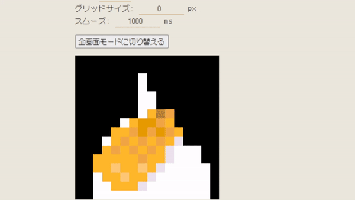

# .Spectrum
dot spectrum is a pixel-art-like spectrum analyzer. w/ Web Audio API.

## 🛠️ Getting Start

~~`yarn static -p 8080`~~

## 📚 Tech Stack
- Canvas API
- Web Audio API
- PWA

## ❤️ Acknowledgments

マルモニカ - 患者長ひっく (https://twitter.com/hicchicc) 様

https://00ff.booth.pm/items/4927023
