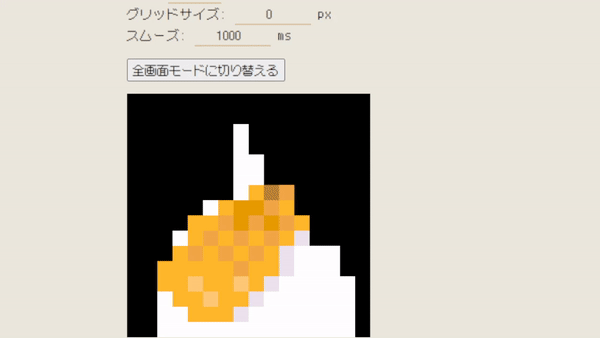

# .Spectrum

dot spectrum is a pixel-art-like spectrum analyzer. w/ Web Audio API.

## 📚 Tech Stack

- Canvas API
- Web Audio API
- PWA

## ❤️ Acknowledgments

マルモニカ - 患者長ひっく (https://twitter.com/hicchicc) 様

https://00ff.booth.pm/items/4927023

## Third-party licenses

Video conversion uses [ffmpeg.wasm](https://github.com/ffmpegwasm/ffmpeg.wasm). `@ffmpeg/ffmpeg` and `@ffmpeg/util` are MIT. The FFmpeg core (`@ffmpeg/core` / `@ffmpeg/core-mt`), which is bundled into the build and served with this site, is licensed under [GPL-2.0-or-later](https://www.gnu.org/licenses/old-licenses/gpl-2.0.html) because it includes FFmpeg and libraries such as x264. Its source (build scripts pinning the upstream versions) is at the tag of the bundled version in [ffmpegwasm/ffmpeg.wasm](https://github.com/ffmpegwasm/ffmpeg.wasm/tags). The version is in `package-lock.json` and in the link in the page footer.
